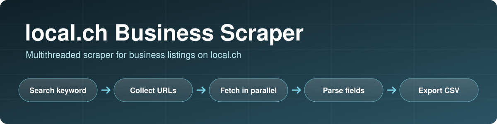
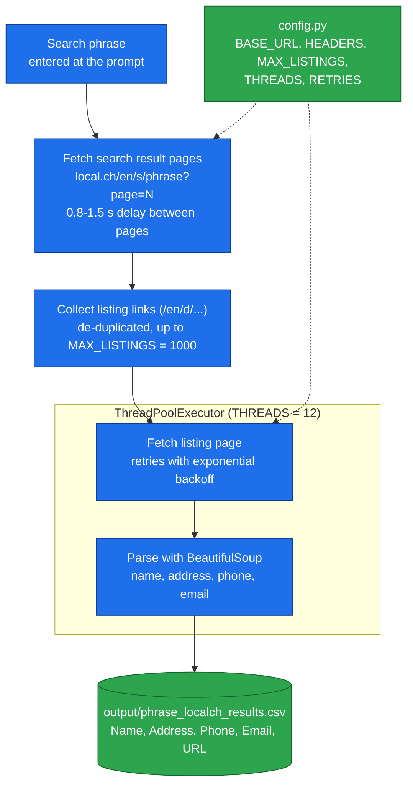

<p align="center">
  
</p>

<p align="center">
  
  
  
  
</p>

# local.ch Business Scraper

**A multithreaded Python scraper that takes a search phrase such as "restaurants in Zurich", collects up to 1,000 business listing pages from [local.ch](https://www.local.ch), and exports each listing's name, address, phone, email and URL to a CSV file.**

It uses plain `requests` and BeautifulSoup (no browser), fetches listing pages in parallel with a thread pool, and retries failed requests with exponential backoff.

> **Use responsibly.** Check local.ch's terms of use and `robots.txt` before scraping, and follow the data-protection rules that apply to collecting business contact details (for example the Swiss FADP or the GDPR) before storing or using emails and phone numbers.

---

## Key features

- **Keyword search**: enter any local.ch search phrase at the prompt.
- **Two-stage scraping**: first collect listing URLs from the paginated search results, then scrape each listing page.
- **Parallel fetching** with a `ThreadPoolExecutor` (12 workers by default).
- **Resilient requests**: up to 5 retries per URL with exponential backoff plus random jitter, and a short random delay between search pages.
- **Configurable limits** in `config.py`: listing cap, thread count and retry count.
- **CSV export** to `output/<search_phrase>_localch_results.csv`.

---

## Architecture



### Parsed fields

| Column | Source on the listing page |
|---|---|
| `Name` | the page's `h1` |
| `Address` | the `address` element (or an element with `data-testid="address"`) |
| `Phone` | the first `tel:` link |
| `Email` | the first `mailto:` link |
| `URL` | the listing URL |

Any field that is not found is written as `N/A`.

---

## Project structure

```
localch-scraper/
├── scraper.py      # entrypoint: prompt, collect URLs, scrape, save
├── utils.py        # safe_get with retries, URL collection, listing parser, CSV writer
├── config.py       # base URL, headers, limits
└── requirements.txt
```

---

## Setup and usage

```bash
git clone https://github.com/talha142/localch-scraper.git
cd localch-scraper

python -m venv venv
source venv/bin/activate          # Windows: venv\Scripts\activate
pip install -r requirements.txt

python scraper.py
```

Enter a search phrase when prompted, for example `restaurants in Zurich`. The results are saved to `output/restaurants_in_Zurich_localch_results.csv`.

### Configuration (`config.py`)

| Setting | Default | Meaning |
|---|---|---|
| `MAX_LISTINGS` | `1000` | Maximum number of listing URLs to collect |
| `THREADS` | `12` | Parallel workers for listing pages |
| `RETRIES` | `5` | Attempts per request before giving up |
| `HEADERS` | a desktop Chrome user agent | Request headers |

---

## Limitations

- **Address extraction rarely works.** In a 1,000-listing sample run (restaurants in Zurich), phone numbers were found for 902 listings and emails for 560, but the address for only 7, so the `address` selector needs to be updated to the site's current markup.
- **Selectors depend on local.ch's HTML** and will need maintenance when the site changes.
- **The URL collection loop stops only when it reaches the listing cap or a request fails.** A search with fewer results than the cap, or a page that returns no new listings, may keep requesting pages.
- Scraped contact details can be personal data; do not commit or share result files (the `output/` folder and CSV files are git-ignored).
- No automated tests, and dependency versions are not pinned.

## Future improvements

- Fix the address selector and add fields such as category, opening hours and rating.
- Stop paging when a page returns no new listings, and support command-line arguments instead of the prompt.
- Add tests using saved HTML pages, and pin dependency versions.
